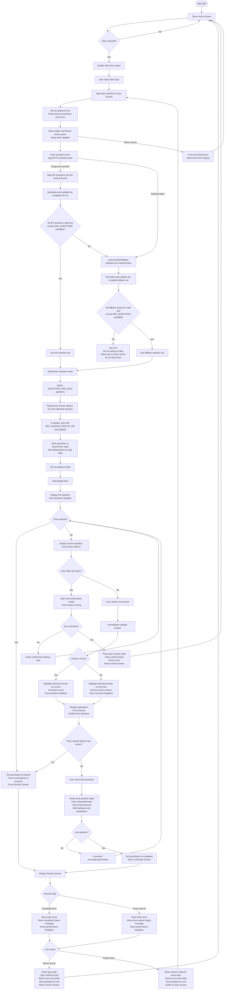

# Quiz App User Flow

```mermaid
flowchart TD
    A([App start]) --> B[Show Home Screen]
    B --> C{Topic selected?}
    C -- No --> B
    C -- Yes --> D[Enable Start Quiz button]
    D --> E[User clicks Start Quiz]
    E --> F[App state switches to Quiz Screen]
    F --> LOAD_START[Set isLoading to true<br/>Clear previous questions and errors]
    LOAD_START --> SHOW_LOADING[Show loader and Return Home action<br/>Keep timer stopped]
    SHOW_LOADING --> FETCH_API[Fetch questions from QuizAPI for selected topic]
    SHOW_LOADING -- Return Home --> CANCEL_LOADING[Unmount QuizScreen<br/>Abort active API request]
    CANCEL_LOADING --> B
    FETCH_API -- Response received --> MAP_API[Map API questions into the internal format]
    FETCH_API -- Request failed --> LOAD_FALLBACK
    MAP_API --> VALIDATE_API[Normalize and validate the complete API set]
    VALIDATE_API --> API_READY{All API questions valid and<br/>at least MIN_QUESTIONS available?}
    API_READY -- Yes --> USE_API[Use API question set]
    API_READY -- No --> LOAD_FALLBACK[Load bundled fallback questions for selected topic]
    LOAD_FALLBACK --> VALIDATE_FALLBACK[Normalize and validate the complete fallback set]
    VALIDATE_FALLBACK --> FALLBACK_READY{All fallback questions valid and<br/>at least MIN_QUESTIONS available?}
    FALLBACK_READY -- No --> LOAD_ERROR[Set error<br/>Set isLoading to false<br/>Allow user to return Home<br/>Do not start timer]
    FALLBACK_READY -- Yes --> USE_FALLBACK[Use fallback question set]
    USE_API --> SHUFFLE_QUESTIONS[Randomize question order]
    USE_FALLBACK --> SHUFFLE_QUESTIONS
    SHUFFLE_QUESTIONS --> SELECT_QUESTIONS[Select QUESTIONS_PER_QUIZ questions]
    SELECT_QUESTIONS --> SHUFFLE_ANSWERS[Randomize answer options for each selected question]
    SHUFFLE_ANSWERS --> MIN_LOADING_TIME[If needed, wait until MIN_LOADING_DISPLAY_MS has elapsed]
    MIN_LOADING_TIME --> STORE_QUESTIONS[Store questions in QuizScreen state<br/>Set totalQuestions in App state]
    STORE_QUESTIONS --> LOAD_SUCCESS[Set isLoading to false]
    LOAD_SUCCESS --> START_TIMER[Start global timer]
    START_TIMER --> R[Display first question<br/>Next Question disabled]

    R --> S{Timer expired?}
    S -- Yes --> T[Set quizStatus to expired<br/>Count unanswered as incorrect<br/>Force Results Screen]
    S -- No --> U[Display current question and answer options]

    U --> V{User clicks Exit Quiz?}
    V -- Yes --> W[Open exit confirmation modal<br/>Timer keeps running]
    W --> X{Exit confirmed?}
    X -- No --> Y[Close modal and continue quiz]
    Y --> S
    X -- Yes --> Z[Reset quiz session state<br/>Clear selected topic<br/>Reset score<br/>Return Home Screen]
    Z --> B
    V -- No --> AA[User selects one answer]

    AA --> AB[Immediately validate answer]
    AB --> AC{Answer correct?}
    AC -- Yes --> AD[Highlight selected answer as correct<br/>Increment score<br/>Show positive feedback]
    AC -- No --> AE[Highlight selected answer as incorrect<br/>Reveal correct answer<br/>Show incorrect feedback]
    AD --> AF[Display explanation<br/>Lock answers<br/>Enable Next Question]
    AE --> AF
    AF --> AG{Timer expired before next action?}
    AG -- Yes --> T
    AG -- No --> AH[User clicks Next Question]
    AH --> AI[Reset local question state<br/>Clear selectedAnswer<br/>Clear hasAnswered<br/>Hide feedback and explanation]
    AI --> AJ{Last question?}
    AJ -- No --> AK[Increment currentQuestionIndex]
    AK --> S
    AJ -- Yes --> AL[Set quizStatus to completed<br/>Move to Results Screen]

    T --> AM[Display Results Screen]
    AL --> AM
    AM --> AN{Results state}
    AN -- Completed quiz --> AO[Show final score<br/>Show completed status message<br/>Show performance feedback]
    AN -- Timer expired --> AP[Show final score<br/>Show time expired status message<br/>Show performance feedback]
    AO --> AQ{User action}
    AP --> AQ
    AQ -- Return Home --> AR[Reset app state<br/>Clear selected topic<br/>Reset score and totals<br/>Set quizStatus to null<br/>Return Home Screen]
    AQ -- Retake Quiz --> AS[Reset session state for same topic<br/>Reset score and totals<br/>Set quizStatus to null<br/>Switch to Quiz Screen]
    AR --> B
    AS --> F
```
