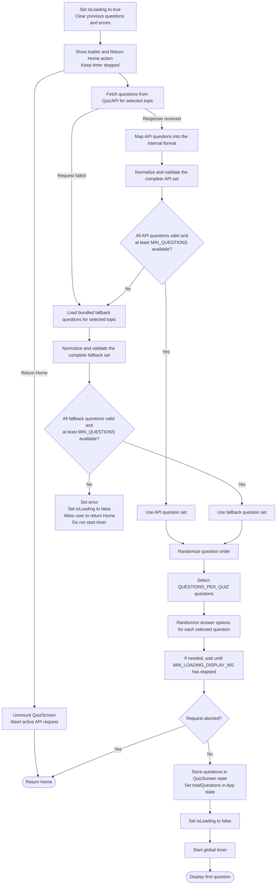

# QuizScreen Loading Flow

This diagram describes how `QuizScreen` loads, validates, and prepares questions before starting the quiz timer.

For the complete user journey, see the [Quiz App user flow](./mermaid.md).
